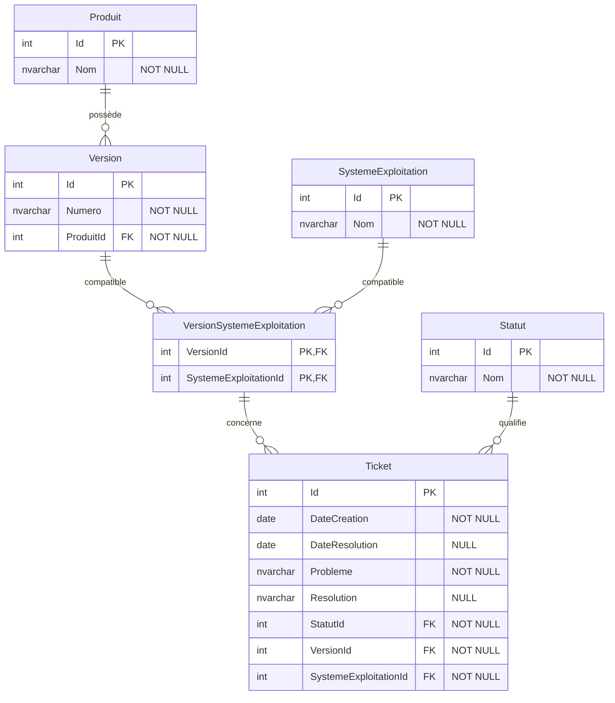

# Projet6-NexaWorks

Conception et création d'une base de données relationnelle pour l'entreprise
NexaWorks, destinée à suivre les problèmes (tickets) rencontrés sur ses
logiciels, version par version et système d'exploitation par système
d'exploitation.

## Contexte

NexaWorks édite plusieurs produits logiciels. Chaque produit existe en
plusieurs versions, et chaque version est compatible avec un ou plusieurs
systèmes d'exploitation (Windows, MacOS, Linux, Android, iOS, Windows Mobile).
L'entreprise a besoin de tracer les problèmes qui surviennent sur chaque
version et chaque système, ainsi que leur résolution.

Ce dépôt contient la conception de la base de données, les données d'exemple
(tickets), le code de création de la base, les requêtes d'interrogation et la
documentation associée.

## Modèle entité-association

Le schéma est aussi disponible en PDF : [modele-entite-association.pdf](docs/modele-entite-association.pdf).

## Description des tables

| Table | Rôle | Points clés |
|-------|------|-------------|
| `Produit` | Un logiciel édité par NexaWorks | nom du produit |
| `Version` | Une version d'un produit | `Numero` (texte), `ProduitId` (clé étrangère vers Produit) |
| `SystemeExploitation` | Un système d'exploitation | table de référence (6 valeurs) |
| `VersionSystemeExploitation` | Compatibilité entre une version et un OS | table d'association, clé primaire composite `(VersionId, SystemeExploitationId)` |
| `Statut` | État d'un ticket | table de référence (En cours, Résolu) |
| `Ticket` | Un problème signalé sur une version et un OS | dates, description, résolution, liens vers Statut et vers la combinaison version + OS |

## Choix de conception

- **Troisième forme normale.** On ne stocke jamais une donnée qu'on peut
  déduire. Le produit d'un ticket n'est pas enregistré directement : on le
  retrouve en remontant du ticket vers sa version, puis de la version vers son
  produit.
- **Relation plusieurs-à-plusieurs entre version et OS.** Une version tourne
  sur plusieurs OS et un OS concerne plusieurs versions. Cette relation est
  portée par la table d'association `VersionSystemeExploitation`, où chaque
  ligne représente une compatibilité.
- **Clé étrangère composite sur le ticket.** Les colonnes `VersionId` et
  `SystemeExploitationId` d'un ticket forment ensemble une clé étrangère vers
  la table d'association. Cela garantit qu'un ticket ne peut concerner qu'un
  couple version + OS réellement compatible.
- **Numéro de version en texte.** Un numéro comme « 1.2 » n'est pas un nombre
  (« 1.10 » vient après « 1.9 » et n'égale pas « 1.1 »). C'est une étiquette,
  donc du texte.
- **Dates au jour près.** Les tickets sont datés au jour (type `date`). Les
  données fournies et les requêtes demandées ne nécessitent pas l'heure.
