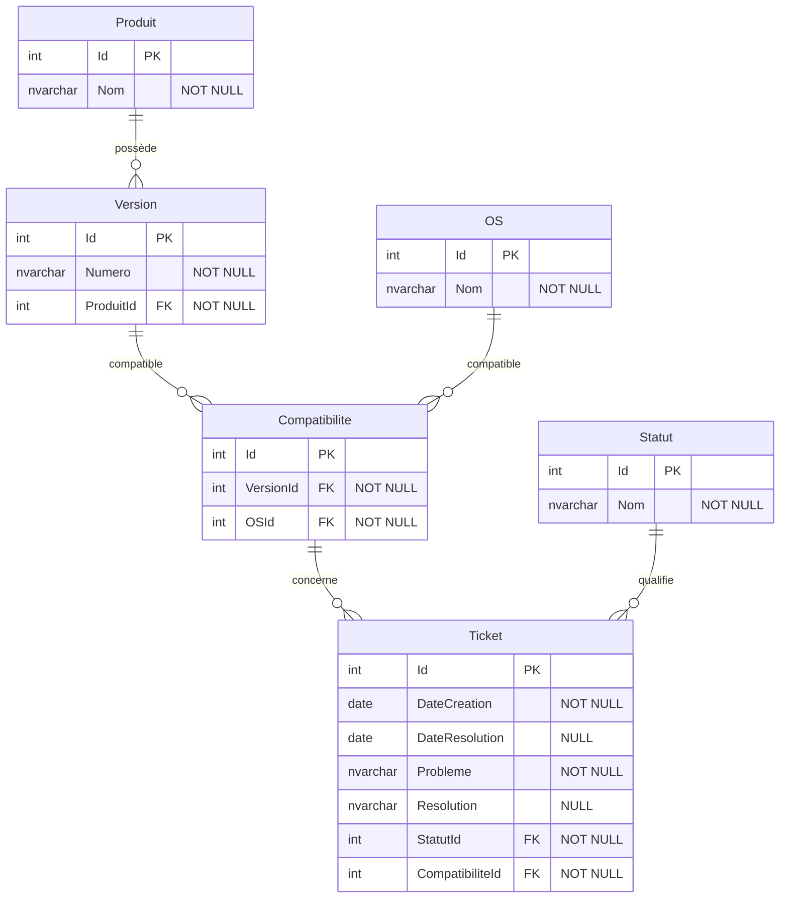

# Projet6-NexaWorks

Conception et création d'une base de données relationnelle pour l'entreprise
NexaWorks, destinée à suivre les problèmes (tickets) rencontrés sur ses
logiciels, version par version et système d'exploitation par système
d'exploitation.

## Contexte

NexaWorks édite plusieurs produits logiciels. Chaque produit existe en
plusieurs versions, et chaque version est compatible avec un ou plusieurs
systèmes d'exploitation (Windows, MacOS, Linux, Android, iOS, Windows Mobile).
L'entreprise a besoin de tracer les problèmes qui surviennent sur chaque
version et chaque système, ainsi que leur résolution.

Ce dépôt contient la conception de la base de données, les données d'exemple
(tickets), le code de création de la base, les requêtes d'interrogation et la
documentation associée.

## Modèle entité-association



Le schéma est aussi disponible en PDF : [modele-entite-association.pdf](docs/modele-entite-association.pdf).

## Comment lire le schéma (notation « patte d'oie »)

Les petits symboles au bout de chaque trait indiquent la **cardinalité**,
c'est-à-dire « combien ». On lit chaque relation par ses deux extrémités.

- `||` (deux petites barres) : **exactement un**.
- `o{` (un rond suivi d'une « patte d'oie », la fourche à trois branches) :
  **zéro ou plusieurs**. La patte d'oie marque le côté « plusieurs », et le
  rond juste avant signifie « éventuellement zéro ».

Exemple avec `Produit ||--o{ Version` :

- côté **Produit**, le `||` : un produit et un seul ;
- côté **Version**, le `o{` : zéro ou plusieurs versions.

Donc **une version appartient à exactement un produit, et un produit possède
zéro ou plusieurs versions**. Le mot sur le trait (« possède ») nomme la
relation. La même lecture s'applique à tous les traits du schéma.

## Description des tables

| Table | Rôle | Points clés |
|-------|------|-------------|
| `Produit` | Un logiciel édité par NexaWorks | nom du produit |
| `Version` | Une version d'un produit | `Numero` (texte), `ProduitId` (clé étrangère vers Produit) |
| `OS` | Un système d'exploitation | table de référence (6 valeurs) |
| `Compatibilite` | Compatibilité entre une version et un OS | table d'association, clé primaire `Id`, unicité sur `(VersionId, OSId)` |
| `Statut` | État d'un ticket | table de référence (En cours, Résolu) |
| `Ticket` | Un problème signalé sur une version et un OS | dates, description, résolution, liens vers Statut et vers la compatibilité (version + OS) |

## Choix de conception

- **Troisième forme normale.** On ne stocke jamais une donnée qu'on peut
  déduire. Le produit d'un ticket n'est pas enregistré directement : on le
  retrouve en remontant du ticket vers sa compatibilité, puis vers la version,
  puis vers le produit.
- **Relation plusieurs-à-plusieurs entre version et OS.** Une version tourne
  sur plusieurs OS et un OS concerne plusieurs versions. Cette relation est
  portée par la table d'association `Compatibilite`, où chaque ligne représente
  une compatibilité. Sa clé primaire est un identifiant unique `Id`, et une
  contrainte d'unicité sur `(VersionId, OSId)` interdit les doublons.
- **Une seule clé étrangère sur le ticket.** Le ticket pointe vers une ligne de
  `Compatibilite` via `CompatibiliteId`. Comme cette ligne représente un couple
  version + OS déjà validé, on garantit qu'un ticket ne concerne qu'une
  combinaison réellement compatible, tout en gardant le ticket simple.
- **Numéro de version en texte.** Un numéro comme « 1.2 » n'est pas un nombre
  (« 1.10 » vient après « 1.9 » et n'égale pas « 1.1 »). C'est une étiquette,
  donc du texte.
- **Dates au jour près.** Les tickets sont datés au jour (type `date`). Les
  données fournies et les requêtes demandées ne nécessitent pas l'heure.

## Technologies

- **.NET 10** et **C#**
- **Entity Framework Core 10**, approche **Code-First** (les classes C# décrivent
  les tables, EF Core génère la base)
- **SQL Server LocalDB** comme moteur de base de données
- Requêtes en **LINQ** et en **procédures stockées T-SQL**

## Installation et exécution

Prérequis : le SDK **.NET 10**, une instance **SQL Server LocalDB**, et l'outil
Entity Framework Core (`dotnet tool install --global dotnet-ef`).

```bash
cd src/NexaWorks.Data
dotnet ef database update   # crée la base NexaWorks sur LocalDB (applique la migration)
dotnet run                  # remplit la base puis affiche la démonstration des 20 requêtes
```

- `dotnet ef database update` applique la migration et crée le schéma.
- `dotnet run` remplit la base (données de référence et 25 tickets) puis exécute
  la démonstration des 20 requêtes.

## Les requêtes

Les 20 requêtes demandées ne diffèrent que par cinq critères (statut, produit,
version, période, mots-clés). Elles sont donc optimisées en **une seule requête
paramétrée**, où chaque critère est un paramètre optionnel : un paramètre laissé
vide est ignoré. Elle est fournie de deux façons :

- **LINQ** : la méthode `ObtenirTickets` dans `src/NexaWorks.Data/Requetes.cs`.
- **Procédure stockée** : `ObtenirTickets` dans `sql/ObtenirTickets.sql`.

La démonstration des 20 demandes est faite par le programme (`dotnet run`) et par
le script `sql/Demo-20-requetes.sql`. Le détail (but, paramètres, résultats) est
dans `docs/Documentation-des-requetes-NexaWorks.xlsx`.

## Sauvegarde de la base (dump)

Une sauvegarde complète est fournie dans `sql/NexaWorks.bak` (produite par le
script `sql/Backup-Database_NexaWorks.sql`). Pour la restaurer sur une instance
SQL Server :

```sql
RESTORE DATABASE NexaWorks
FROM DISK = 'C:\chemin\vers\NexaWorks.bak'
WITH REPLACE;
```
